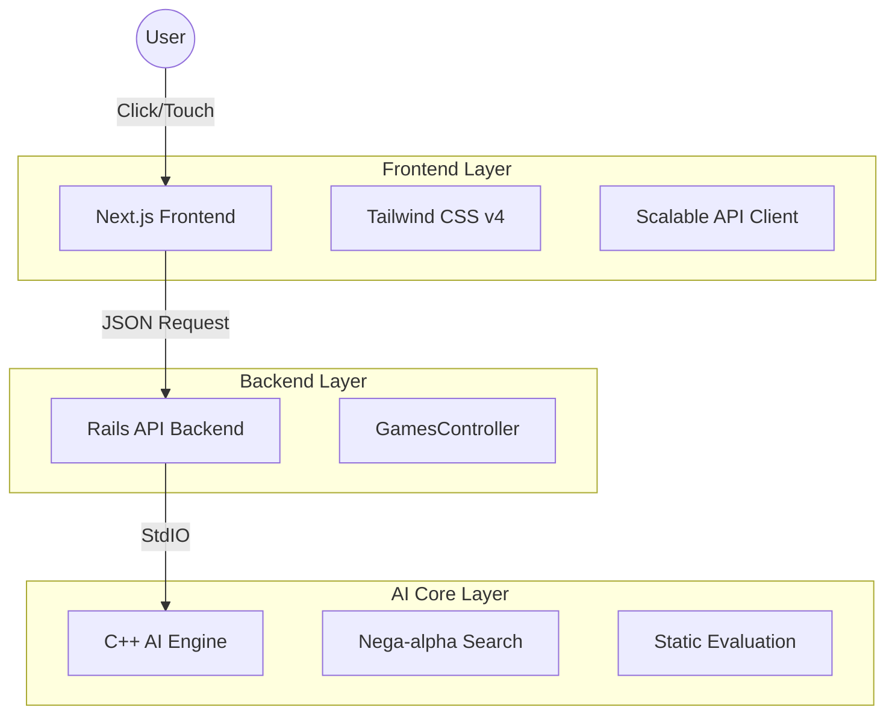

# Othello GUI

**Modern, Fast, and Beautiful.**

本プロジェクトは、**「超高速なC++思考エンジン」**、**「堅牢なRails API」**、そして**「没入感のあるNeumorphism Frontend」**の3層構造で構成されるモダンなWebアプリケーションです。

<p align="center">
  
</p>

## 🏗 System Overview



---

## 1. 🧠 AI Core (C++ Layer)

オセロの頭脳となる部分は、パフォーマンスを極限まで追求するために **C++** で実装されています。

### **技術的特徴**
- **高速な盤面表現**:
    - オセロの盤面（8x8=64マス）を効率的に扱うため、独自のデータ構造（配列ベースの高速アクセス）を採用。
    - `board.hpp` にて、**事前計算されたテーブル**（`legal_arr`, `flip_arr`）を使用し、合法手判定や石の反転処理を $O(1)$ に近い速度で実行します。
- **探索アルゴリズム**:
    - **Nega-alpha法** (`ai1.cpp`): Minimax法の改良版。不要な探索枝を刈り取る（枝刈り）ことで、深さ読みの速度を飛躍的に向上させています。
    - **静的評価関数** (`cell_evaluate.hpp`): 盤面の各マスに重み付け（角は高得点、X打ちは減点など）を行い、現局面の優劣を数値化します。
- **インターフェース**:
    - 標準入出力（stdin/stdout）を通じた **CLI (Command Line Interface)** として動作。
    - 起動引数などで盤面状態を受け取り、計算結果（次の一手）を出力して即座に終了するステートレスな設計です。

### **File Structure**
```text
backend/othelloai_logic/
├── othello.cpp       # エントリーポイント (APIモード/対話モードの分岐)
├── api.cpp           # (旧) API通信用アダプタ
├── board.hpp         # 盤面クラス・定数テーブル (Core Logic)
├── ai1.cpp           # Nega-alpha探索の実装
└── cell_evaluate.hpp # 評価関数・重みテーブル
```

---

## 2. 🔌 Backend API (Ruby on Rails 8)

フロントエンドからのリクエストを受け付け、安全にC++エンジンを実行して結果を返す **API Gateway** の役割を果たします。

### **API Design**
- **Endpoint**: `POST /api/v1/games/next_move`
- **Request**:
    ```json
    {
      "board": "0000000000000000000000000001200000021000000000000000000000000000",
      "turn": 0  // 0: Black, 1: White
    }
    ```
- **Response**:
    ```json
    {
      "next_move": 19 // インデックス (0-63)
    }
    ```

### **実装のこだわり**
- **`Open3.capture3`**: Rubyの標準機能を用いてC++プロセスを生成し、安全に実行結果をキャプチャします。
- **Input Validation**: 不正な盤面データ（長さが違う、不正な文字など）が送られてきた場合、C++を実行する前にRails側で遮断し、適切なエラーを返します。
- **API Mode**: `rails new --api` で生成された軽量な構成。View層を持たず、JSONのやり取りに特化しています。

---

## 3. 🎨 Frontend (Next.js + Tailwind CSS v4)

ユーザーが直接触れるインターフェース。**「触りたくなるUI」** をテーマに設計されています。

### **Design System: Neumorphism (Soft UI)**
「画面から要素が隆起している」ような質感を表現するため、光と影を緻密に計算した **Neumorphism** を採用。

- **Lighting Theory**: 左上からの光源を想定。
    - **Flat (通常時)**: 左上に「明るいハイライト」、右下に「暗い影」を落とし、面が浮き上がって見えるようにする。
    - **Pressed (クリック時)**: 影を**Inset（内側）**に反転させ、面が押し込まれたように見せる。
- **Color Palette**:
    - Base: `#E0E5EC` (青みがかったグレー)
    - Text: `#4A5568` (視認性の高いダークグレー)
    - Accent: `#4FD1C5` (Teal系、強調色)
- **Implementation**:
    - **Tailwind CSS v4** の `@theme` ディレクティブを活用し、`globals.css` にこれらをCSS変数として定義。
    - クラス名 `shadow-neumorphism-flat` などを付与するだけで、どこでも統一されたデザインが適用可能。

### **Scalable API Architecture**
将来的な拡張を見据え、通信ロジックを2層に分離しています。

1.  **`apiClient.ts` (Infrastructure Layer)**
    - アプリケーション全体の通信基盤。
    - Base URLの解決、共通ヘッダーの付与、統一されたエラーハンドリング（`ApiError`）を担当。
    - シングルトンパターンに近い構成で、設定の一元管理を実現。
2.  **`gameApi.ts` (Domain Layer)**
    - ゲーム固有のビジネスロジック。
    - 「次の一手を取得する」という具体的なユースケースをメソッドとして定義。
    - コンポーネントからは `fetch` や `axios` の存在を隠蔽し、ドメインの言葉で操作可能にします。

---

## 🚀 Getting Started

### Prerequisites
- Node.js (v20+)
- Ruby (v3.4+) & Rails (v8.1+)
- C++ Compiler (g++ or clang++)

### Installation & Run

#### 1. Backend Setup
```bash
cd backend
bundle install
# C++エンジンのコンパイル
cd othelloai_logic && g++ -O3 -o othello othello.cpp
cd ..
# サーバー起動 (Port: 3001)
bin/rails s -p 3001
```

#### 2. Frontend Setup
```bash
cd frontend
npm install
# 開発サーバー起動 (Port: 3000)
npm run dev
```

Webブラウザで `http://localhost:3000` にアクセスしてください。

## � Roadmap
- **認証機能**: ユーザーログイン、戦績保存。
- **リアルタイム対戦**: ActionCable または WebSocket を用いた対人戦。
- **PWA化**: モバイル端末でのネイティブアプリのような体験。

## 🤝 Contributing
Collaborators are welcome!
Please check the repository settings for contribution guidelines.

---
Created by [nana743533](https://github.com/nana743533)
