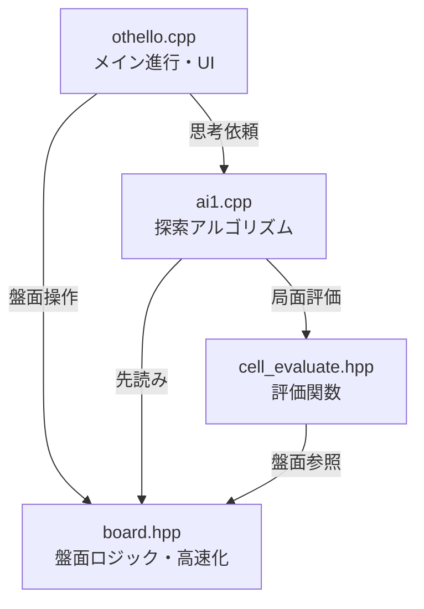

# Othello AI Logic

このディレクトリには、C++で実装されたオセロAIのコアロジックが含まれています。
GUIアプリケーションから呼び出されることを想定した、高速なビットボード/インデックスベースの処理系です。

## 🎯 AIの設計と動作

### コアアルゴリズム: Nega-alpha探索
AIは**Nega-alpha法**を使用しています。これはアルファベータ枝刈りを用いたMinimaxアルゴリズムの最適化版です。主な特徴:

1. **反復深化**: 浅い探索から始めて徐々に深くし、時間制限内での探索を可能にします
2. **置換表**: 評価済みの局面をキャッシュし、重複計算を回避します
3. **ムーブオーダリング**: 前回の探索結果に基づいて有望な手を優先し、枝刈りの効率を向上させます
4. **静的評価**: 位置による重みを使用して、非終端局面を評価します

### 探索パラメータ
- **デフォルト深さ**: 9手先読み
- **オフセット**: 3（反復深化のため、深さ6から開始）
- **計算量**: O(b^d) ただし b は分岐因子(~7-10)、d は深さ

### 評価関数
**静的な位置評価**手法を使用:
- **角マス** (0, 7, 56, 63): 最高値（絶対に返されない）
- **Cマス** (角の隣): 負の値（危険）
- **Xマス** (角の斜め): 非常に負の値（角を失う原因になりやすい）
- **辺マス**: 中程度の正の値
- **中央マス**: 低〜中程度の値

評価は効率化のため、事前計算されたラインスコアを用いて計算されます。

## 📂 ファイル構成

### [othello.cpp](othello.cpp)
AIエンジンのメインエントリポイント。
- コマンドライン引数（盤面状態と手番）を解析
- 盤面と評価テーブルを初期化
- AI探索を実行し、最善手を出力
- **主な関数**:
    - `main`: 初期化と探索を統括

### [board.hpp](board.hpp)
オセロの盤面状態を管理するヘッダーファイルです。
- **特徴**: 高速化のため、盤面を特定のインデックス（3進数表現など）で管理し、事前計算されたテーブルを用いて合法手判定や石の反転を定数時間に近い処理で行います。
- **主な機能**:
    - `legal_place`: 合法手の判定。
    - `move`: 着手処理と石の反転。
    - `init_board`: 遷移テーブルの初期化。

### [ai1.cpp](ai1.cpp)
AI探索エンジンの実装。
- **アルゴリズム**: **Nega-alpha法**（Alpha-beta枝刈りを用いた改良版Minimax）
- 指定された深さまで先読み探索を行い、最善手を返す
- **主な関数**:
    - `search`: 反復深化を用いたルート探索関数
    - `nega_alpha`: Alpha-beta枝刈りを用いた再帰探索
    - `moveordering_evaluate`: Move ordering用のヒューリスティック

### [cell_evaluate.hpp](cell_evaluate.hpp)
盤面位置の静的評価関数。
- **手法**: **位置による重み付け評価**
- 各マスに事前に決定されたスコアを割り当て（角は高く、Xマスは負、など）
- 非終端局面の現在の盤面スコアを計算
- **主な関数**:
    - `evaluate`: 盤面状態の評価スコアを計算
    - `evaluate_init`: 事前計算された評価テーブルを初期化
    
### [test_othello.cpp](test_othello.cpp)
包括的なユニットテストスイート。
- 主要機能をカバーする31個のテストケース
- 盤面操作、合法手、AI探索、エッジケースをテスト
- シンプルなアサーションベースのテストフレームワーク
- `make test` で実行

## 🛠 Dependencies

- 標準C++ライブラリ (`<iostream>`, `<stdio.h>`, `<string>`)
- 各ファイルは相互に依存しています（`othello.cpp` が他をインクルード）。

## 🚀 ビルドと実行

### AIエンジンのビルド

Makeを使用（推奨）:
```bash
make          # othelloバイナリをビルド
make clean    # ビルド成果物をクリーン
make rebuild  # クリーンして再ビルド
```

または手動でビルド:
```bash
g++ -Wall -Wextra -O3 -o othello othello.cpp
```

### AIエンジンの実行（APIモード）

```bash
./othello [board_string] [turn]
```

- **board_string**: 盤面64マスの状態を表す文字列。
  - `0`: 空き
  - `1`: 黒石
  - `2`: 白石
  - 左上(A1)から右下(H8)への順序。合計64文字。
- **turn**: 手番。
  - `0`: 黒番
  - `1`: 白番
- **出力**:
  - 次の一手のインデックス（0〜63）。

### 実行例
```bash
# 標準的な初期局面（黒番）
./othello "0000000000000000000000000002100000012000000000000000000000000000" 0
# 出力: 19 (4つの合法な初手のうちの1つ)
```

## 🧪 テスト

### ユニットテストの実行

プロジェクトには以下をカバーする包括的なユニットテストが含まれています:
- 盤面の初期化
- 盤面表現の変換
- 合法手の検出
- 着手の実行
- パス局面
- AI探索機能
- エッジケース

Makeを使用してテストを実行:
```bash
make test     # 全テストをビルドして実行
```

または手動でビルドして実行:
```bash
g++ -Wall -Wextra -O2 -o test_othello test_othello.cpp
./test_othello
```

### テストカバレッジ

テストスイートには31個のテストケースが含まれています:
1. **盤面の初期化** - ルックアップテーブルが正しく初期化されることを確認
2. **盤面変換** - idx ↔ 配列の変換関数をテスト
3. **初期局面の合法手** - 4つの合法な初手を検証
4. **着手の実行** - 着手の適用と手番の切り替えをテスト
5. **パス局面** - 合法手がない局面を処理
6. **角の位置** - 初期局面で角が合法手でないことを検証
7. **評価関数** - 静的評価関数をテスト
8. **AI探索** - AIが合法手を返すことを検証
9. **盤面の等価性** - 盤面比較演算子をテスト
10. **連続着手** - 複数回の連続した着手をテスト



### 🔄 実行の流れ（AIの手番）

1. **思考開始 (`othello.cpp`)**: 
   - AIの手番が来ると、`othello.cpp` が `search(b, 10)` を呼び出し、現在の盤面 `board b` を渡して「10手読み」を依頼します。

2. **探索 (`ai1.cpp`)**: 
   - `search` 関数から `nega_alpha` 関数（再帰探索）に入ります。
   - Nega-alpha法により、「自分は最善手（得する手）、相手も最善手（自分を損させる手）」を選び続けると仮定して、ゲーム木を展開します。

3. **盤面シミュレーション (`board.hpp`)**: 
   - AIが未来の盤面を予測する際、`b.move()` を頻繁に呼び出します。
   - `board.hpp` は、事前計算されたテーブル（遷移テーブル）を参照し、石を裏返す処理を高速に行います。ループ計算ではなく配列参照で処理するため、大量の探索が可能になります。

4. **評価 (`cell_evaluate.hpp`)**: 
   - 探索の深さが指定（10手）に達すると、`evaluate(b)` が呼ばれます。
   - 盤面の各マスに設定された重み（`cell_weight`）に基づき、「現局面の有利度」を数値化して返します（角は高得点、危険地帯は減点など）。

5. **決定 (`othello.cpp`)**: 
   - 全ての候補手を調べ終えると、最も評価値が高かった手が `main` 関数に返され、実際に石が置かれます。

## ⚖️ ルートディレクトリ版（v2.0）との比較

ルートディレクトリに追加された新しいファイル群（`othello.cpp`, `ai1.cpp` 等）は、このフォルダ内のコードよりも高度な実装がなされています。主な違いは以下の通りです。

### 1. AIアルゴリズムの強化 (`ai1.cpp`)
ルート版のAIは、以下の技術により探索能力が大幅に向上しています。

- **Transposition Table（置換表）**: 
    - 一度計算した盤面の評価値をメモリ（ハッシュマップ）に保存し、再利用します。これにより、手順が違っても同じ局面になった場合の無駄な再計算を防ぎます。
- **Move Ordering（ムーブオーダリング）**: 
    - 「以前に良かった手」や「置換表にある手」から優先的に探索します。これにより、Nega-alpha法の枝刈り（カット）が効率よく発生し、同じ時間でより深く読めるようになります。
- **Iterative Deepening（反復深化）**: 
    - いきなり指定された深さを探索するのではなく、浅い探索（例: 2手読み）から始めて徐々に深くしていきます。これにより、時間切れになった場合でも「これまでの最善手」を返すことが可能になります。

### 2. パフォーマンスと最適化 (`board.hpp`)
- **Move Ordering用の評価**: 
    - 通常の評価関数とは別に、探索順序を決めるための軽量な評価ロジックが追加されています。
- **ハッシュ関数**: 
    - 盤面状態を一意な数値（ハッシュ値）に変換する機能が追加され、置換表での高速な検索を可能にしています。

### 3. インターフェースの変更
- **`othello.cpp` / `search`**: 
    - `search(b, 9, 3)` のように、反復深化のためのパラメータ（深さとオフセット）を受け取る形に変更されています。