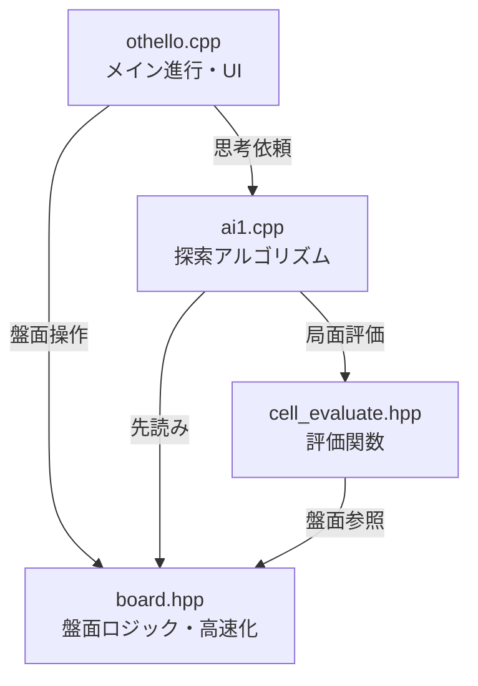

# Othello AI Logic

このディレクトリには、C++で実装されたオセロAIのコアロジックが含まれています。
GUIアプリケーションから呼び出されることを想定した、高速なビットボード/インデックスベースの処理系です。

## 🎯 AI Design & Behavior

### Core Algorithm: Nega-Alpha Search
The AI uses **Nega-alpha** search, an optimized variant of the Minimax algorithm with alpha-beta pruning. Key features:

1. **Iterative Deepening**: Starts with shallow searches and progressively deepens, allowing for time-bounded searches
2. **Transposition Table**: Caches evaluated positions to avoid redundant computation
3. **Move Ordering**: Prioritizes promising moves based on previous search results to improve pruning efficiency
4. **Static Evaluation**: Uses positional weights to evaluate non-terminal board states

### Search Parameters
- **Default Depth**: 9 ply (half-moves)
- **Offset**: 3 (for iterative deepening, starts at depth 6)
- **Time Complexity**: O(b^d) where b is branching factor (~7-10 for Othello) and d is depth

### Evaluation Function
Uses a **static positional evaluation** approach:
- **Corner squares** (0, 7, 56, 63): Highest value (never flipped)
- **C-squares** (adjacent to corners): Negative value (dangerous)
- **X-squares** (diagonal to corners): Very negative (often lead to losing corners)
- **Edge squares**: Moderate positive value
- **Center squares**: Low to moderate value

The evaluation is calculated using pre-computed line scores for efficiency.

## 📂 File Structure

### [othello.cpp](othello.cpp)
Main entry point for the AI engine.
- Parses command-line arguments (board state and turn)
- Initializes board and evaluation tables
- Invokes AI search and outputs the best move
- **Key functions**:
    - `main`: Orchestrates initialization and search

### [board.hpp](board.hpp)
オセロの盤面状態を管理するヘッダーファイルです。
- **特徴**: 高速化のため、盤面を特定のインデックス（3進数表現など）で管理し、事前計算されたテーブルを用いて合法手判定や石の反転を定数時間に近い処理で行います。
- **主な機能**:
    - `legal_place`: 合法手の判定。
    - `move`: 着手処理と石の反転。
    - `init_board`: 遷移テーブルの初期化。

### [ai1.cpp](ai1.cpp)
AI search engine implementation.
- **Algorithm**: **Nega-alpha** (improved Minimax with alpha-beta pruning)
- Performs look-ahead search to specified depth and returns best move
- **Key functions**:
    - `search`: Root search function with iterative deepening
    - `nega_alpha`: Recursive search with alpha-beta pruning
    - `moveordering_evaluate`: Heuristic for move ordering

### [cell_evaluate.hpp](cell_evaluate.hpp)
Static evaluation function for board positions.
- **Method**: **Positional weight evaluation**
- Assigns pre-determined scores to each square (corners high, X-squares negative, etc.)
- Calculates current board score for non-terminal positions
- **Key functions**:
    - `evaluate`: Computes evaluation score for a board state
    - `evaluate_init`: Initializes pre-computed evaluation tables
    
### [test_othello.cpp](test_othello.cpp)
Comprehensive unit test suite.
- 31 test cases covering core functionality
- Tests board operations, legal moves, AI search, and edge cases
- Simple assertion-based test framework
- Run with `make test`

## 🛠 Dependencies

- 標準C++ライブラリ (`<iostream>`, `<stdio.h>`, `<string>`)
- 各ファイルは相互に依存しています（`othello.cpp` が他をインクルード）。

## 🚀 Build & Run

### Building the AI Engine

Using Make (recommended):
```bash
make          # Build the othello binary
make clean    # Clean build artifacts
make rebuild  # Clean and rebuild
```

Or build manually:
```bash
g++ -Wall -Wextra -O3 -o othello othello.cpp
```

### Running the AI Engine (API Mode)

```bash
./othello [board_string] [turn]
```

- **board_string**: 盤面64マスの状態を表す文字列。
  - `0`: 空き
  - `1`: 黒石
  - `2`: 白石
  - 左上(A1)から右下(H8)への順序。合計64文字。
- **turn**: 手番。
  - `0`: 黒番
  - `1`: 白番
- **出力**:
  - 次の一手のインデックス（0〜63）。

### Example
```bash
# Standard initial position (black to move)
./othello "0000000000000000000000000002100000012000000000000000000000000000" 0
# Output: 19 (one of the four legal opening moves)
```

## 🧪 Testing

### Running Unit Tests

The project includes comprehensive unit tests that cover:
- Board initialization
- Board representation conversion
- Legal move detection
- Move execution
- Pass scenarios
- AI search functionality
- Edge cases

Run tests using Make:
```bash
make test     # Build and run all tests
```

Or build and run manually:
```bash
g++ -Wall -Wextra -O2 -o test_othello test_othello.cpp
./test_othello
```

### Test Coverage

The test suite includes 31 test cases covering:
1. **Board Initialization** - Verifies lookup tables are correctly initialized
2. **Board Conversion** - Tests idx ↔ array conversion functions
3. **Initial Position Legal Moves** - Validates 4 legal opening moves
4. **Move Execution** - Tests move application and player switching
5. **Pass Move Scenario** - Handles positions with no legal moves
6. **Corner Positions** - Verifies corners are not legal in initial position
7. **Evaluate Function** - Tests static evaluation function
8. **AI Search** - Validates AI returns legal moves
9. **Board Equality** - Tests board comparison operator
10. **Move Sequence** - Tests multiple consecutive moves



### 🔄 実行の流れ（AIの手番）

1. **思考開始 (`othello.cpp`)**: 
   - AIの手番が来ると、`othello.cpp` が `search(b, 10)` を呼び出し、現在の盤面 `board b` を渡して「10手読み」を依頼します。

2. **探索 (`ai1.cpp`)**: 
   - `search` 関数から `nega_alpha` 関数（再帰探索）に入ります。
   - ネガアルファ法により、「自分は最善手（得する手）、相手も最善手（自分を損させる手）」を選び続けると仮定して、ゲーム木を展開します。

3. **盤面シミュレーション (`board.hpp`)**: 
   - AIが未来の盤面を予測する際、`b.move()` を頻繁に呼び出します。
   - `board.hpp` は、事前計算されたテーブル（遷移テーブル）を参照し、石を裏返す処理を高速に行います。ループ計算ではなく配列参照で処理するため、大量の探索が可能になります。

4. **評価 (`cell_evaluate.hpp`)**: 
   - 探索の深さが指定（10手）に達すると、`evaluate(b)` が呼ばれます。
   - 盤面の各マスに設定された重み（`cell_weight`）に基づき、「現局面の有利度」を数値化して返します（角は高得点、危険地帯は減点など）。

5. **決定 (`othello.cpp`)**: 
   - 全ての候補手を調べ終えると、最も評価値が高かった手が `main` 関数に返され、実際に石が置かれます。

## ⚖️ ルートディレクトリ版（v2.0）との比較

ルートディレクトリに追加された新しいファイル群（`othello.cpp`, `ai1.cpp` 等）は、このフォルダ内のコードよりも高度な実装がなされています。主な違いは以下の通りです。

### 1. AIアルゴリズムの強化 (`ai1.cpp`)
ルート版のAIは、以下の技術により探索能力が大幅に向上しています。

- **置換表 (Transposition Table)**: 
    - 一度計算した盤面の評価値をメモリ（ハッシュマップ）に保存し、再利用します。これにより、手順が違っても同じ局面になった場合の無駄な再計算を防ぎます。
- **ムーブオーダリング (Move Ordering)**: 
    - 「以前に良かった手」や「置換表にある手」から優先的に探索します。これにより、ネガアルファ法の枝刈り（カット）が効率よく発生し、同じ時間でより深く読めるようになります。
- **反復深化 (Iterative Deepening)**: 
    - いきなり指定された深さを探索するのではなく、浅い探索（例: 2手読み）から始めて徐々に深くしていきます。これにより、時間切れになった場合でも「これまでの最善手」を返すことが可能になります。

### 2. パフォーマンスと最適化 (`board.hpp`)
- **Move Ordering用の評価**: 
    - 通常の評価関数とは別に、探索順序を決めるための軽量な評価ロジックが追加されています。
- **ハッシュ関数**: 
    - 盤面状態を一意な数値（ハッシュ値）に変換する機能が追加され、置換表での高速な検索を可能にしています。

### 3. インターフェースの変更
- **`othello.cpp` / `search`**: 
    - `search(b, 9, 3)` のように、反復深化のためのパラメータ（深さとオフセット）を受け取る形に変更されています。